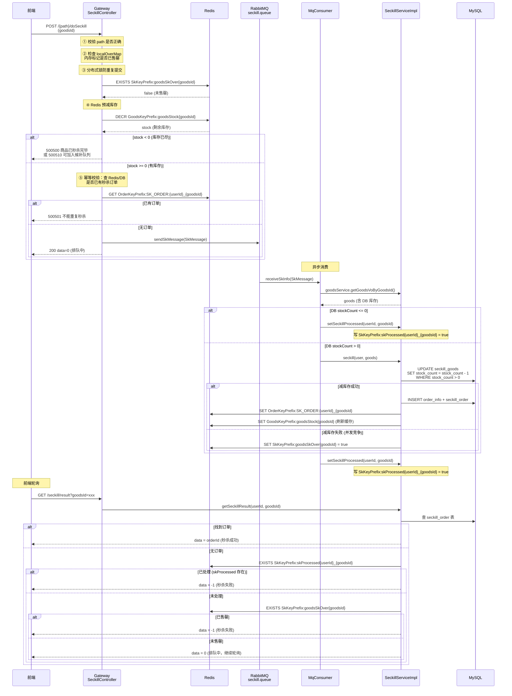
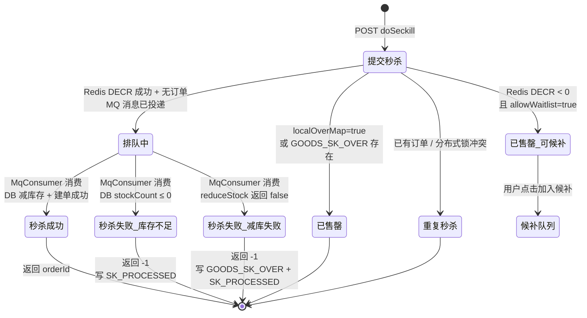
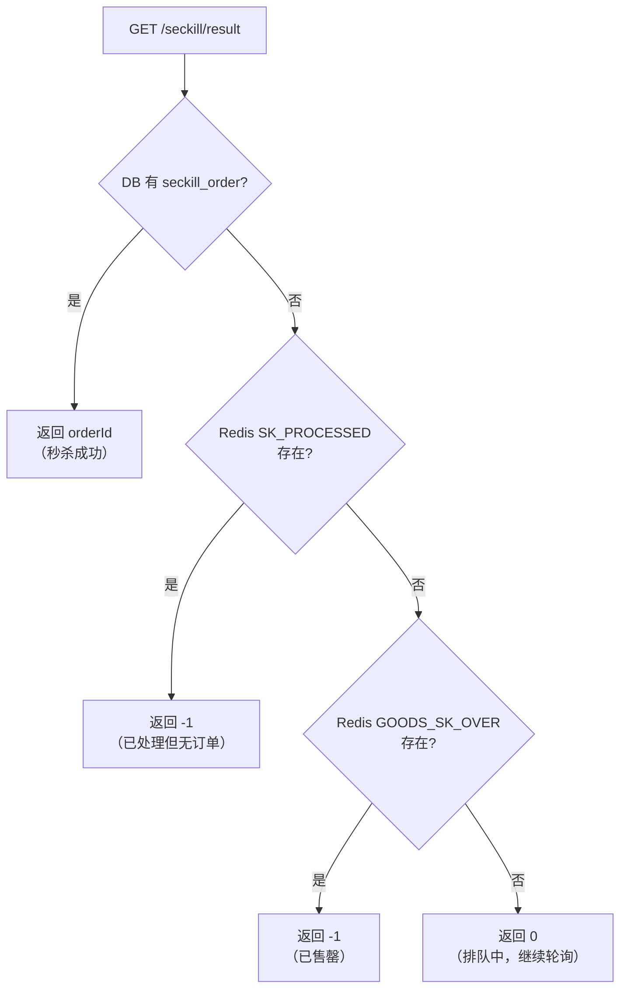
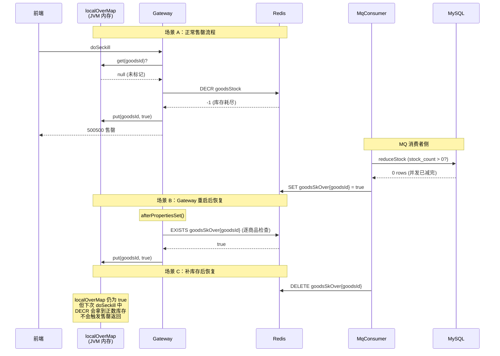
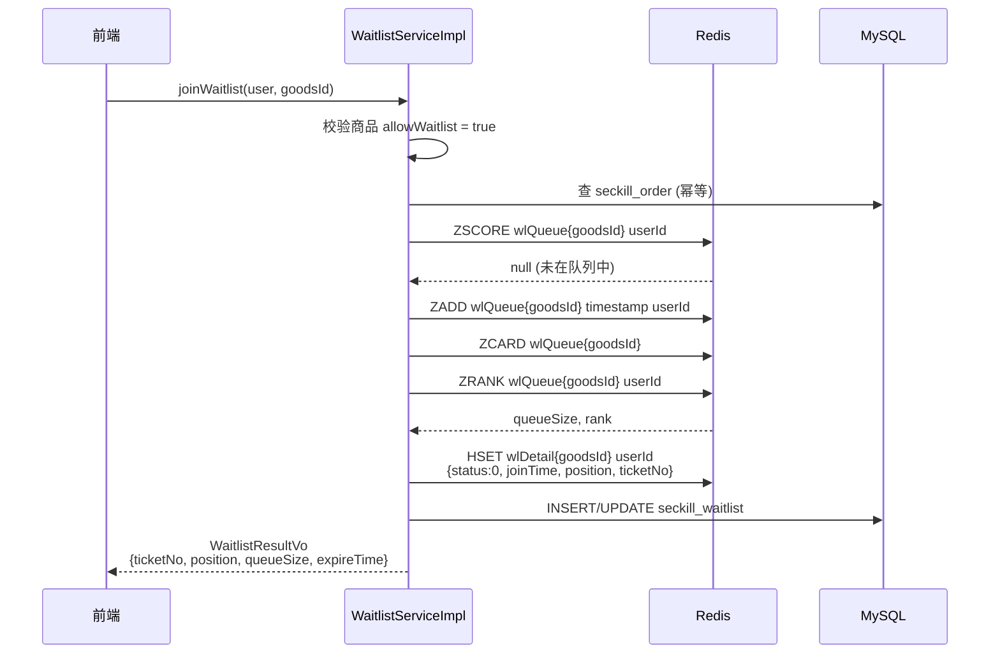
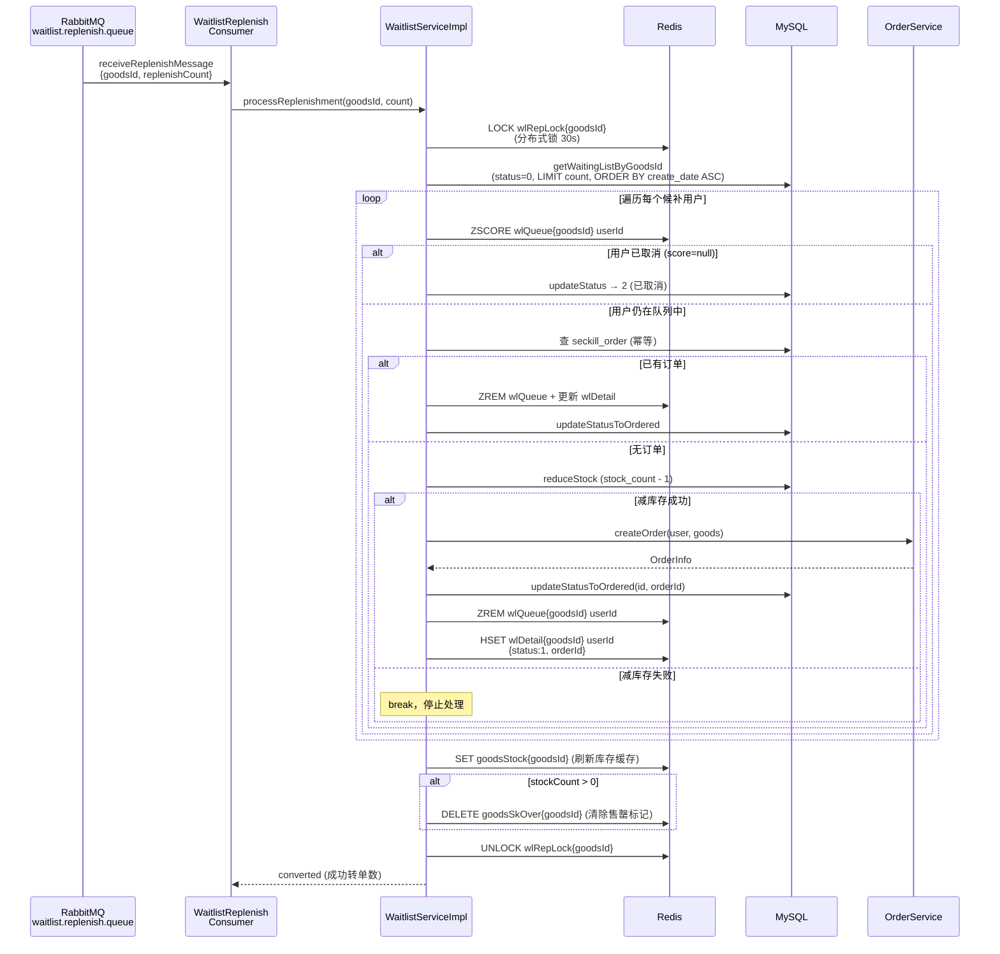
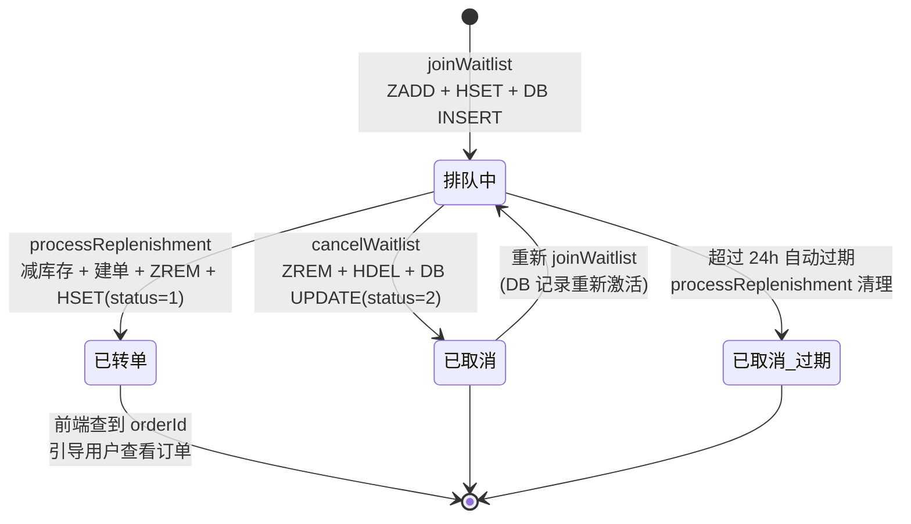

# 异步秒杀 + 候补转单 技术说明

> 本文档面向**前端开发**和**运维人员**，说明异步秒杀的完整链路、状态转移、Redis 关键标记的含义，以及前端轮询结果时各返回值的触发条件。
>
> 涉及核心代码文件：
> - `SeckillController.java`（Gateway 层，秒杀入口）
> - `MqConsumer.java`（MQ 消费者，异步秒杀处理）
> - `WaitlistReplenishConsumer.java`（MQ 消费者，候补补库存处理）
> - `SeckillServiceImpl.java`（秒杀核心业务：减库存、建订单、查结果）
> - `WaitlistServiceImpl.java`（候补队列管理、转单逻辑）

---

## 一、整体架构概览

```
┌──────────┐     ┌──────────────────────┐     ┌─────────────┐     ┌──────────────┐
│  前端     │────▶│  Gateway              │────▶│  RabbitMQ    │────▶│  MQ Consumer │
│ (轮询结果)│◀────│  SeckillController    │     │              │     │  MqConsumer  │
└──────────┘     └──────────────────────┘     └─────────────┘     └──────────────┘
                        │                            │                    │
                        │                            │                    ▼
                        │                            │           ┌──────────────┐
                        ▼                            │           │ SeckillService│
                 ┌──────────────┐                    │           │ (减库存+建单) │
                 │    Redis     │◀───────────────────┘           └──────────────┘
                 │ (库存/订单/  │
                 │  售罄标记)   │           ┌─────────────────────────────────────┐
                 └──────────────┘           │  WaitlistReplenishConsumer           │
                                            │  (候补补库存队列消费)                 │
                                            │         │                            │
                                            │         ▼                            │
                                            │  WaitlistServiceImpl                 │
                                            │  (processReplenishment)              │
                                            └─────────────────────────────────────┘
```

系统使用**异步秒杀**模式：前端提交秒杀请求后，Gateway 仅做前置校验和 Redis 预减库存，通过后投递消息到 RabbitMQ 立即返回「排队中」。真正的减库存和建单操作由 MQ 消费者异步完成。前端通过轮询 `GET /seckill/result` 获取最终结果。

---

## 二、异步秒杀主链路

### 2.1 时序图



### 2.2 doSeckill 返回值说明

| 返回值 | 含义 | 前端行为 |
|--------|------|---------|
| `Result.success(0)` | 排队中，请求已投递 MQ | 开始轮询 `GET /seckill/result` |
| `CodeMsg.SECKILL_OVER` (500500) | 商品已售罄 | 停止轮询，提示用户 |
| `CodeMsg.SECKILL_OVER_WAITLIST` (500510) | 秒杀已结束，但支持候补 | 引导用户加入候补队列 |
| `CodeMsg.REPEATE_SECKILL` (500501) | 重复秒杀（已有订单或并发锁冲突） | 提示用户已秒杀过 |
| `CodeMsg.REQUEST_ILLEGAL` (500102) | path 校验失败 | 提示请求非法 |

### 2.3 getSeckillResult 返回值说明

| 返回值 | 含义 | 判定逻辑 |
|--------|------|---------|
| `orderId > 0` | 秒杀成功 | DB 中查到 `seckill_order` 记录 |
| `0` | 排队中 | DB 无订单 **且** `SK_PROCESSED` 不存在 **且** `GOODS_SK_OVER` 不存在 |
| `-1` | 秒杀失败 | DB 无订单 **且**（`SK_PROCESSED` 存在 **或** `GOODS_SK_OVER` 存在） |

### 2.4 前端「一直显示排队中」的排查指引

如果前端轮询 `getSeckillResult` 始终返回 `0`（排队中），可能的原因：

| 原因 | 排查方式 | 涉及 Redis Key |
|------|---------|---------------|
| MQ 消息尚未消费 | 检查 RabbitMQ 控制台 `seckill.queue` 消息积压量 | — |
| MQ 消费异常，`setSeckillProcessed` 未执行 | 查看 MqConsumer 日志是否有异常 | `SkKeyPrefix:skProcessed{userId}_{goodsId}` 应存在 |
| MQ 消息丢失（未投递成功） | 检查 Gateway 日志 `sendSkMessage` 是否成功 | — |
| `GOODS_SK_OVER` 未设置（库存实际为 0 但标记缺失） | `redis-cli EXISTS SkKeyPrefix:goodsSkOver{goodsId}` | `SkKeyPrefix:goodsSkOver{goodsId}` |

**关键结论**：只要 `MqConsumer.receiveSkInfo` 正常执行，无论秒杀成功还是失败，`SK_PROCESSED` 一定会被设置，前端下次轮询就会拿到 `-1` 或 `orderId`。如果一直返回 `0`，说明 MQ 消费端根本没处理这条消息。

---

## 三、状态转移图

### 3.1 秒杀请求状态



### 3.2 前端轮询结果状态判定流程



---

## 四、Gateway 本地 localOverMap 与 Redis GOODS_SK_OVER

### 4.1 设计目的

在高并发秒杀场景下，商品售罄后仍有大量无效请求。如果每次都访问 Redis 判断售罄，会带来不必要的网络开销。`localOverMap` 作为**第一层拦截**，将售罄判断提前到 JVM 内存。

### 4.2 两者的写入和读取时机

| 操作 | localOverMap | Redis GOODS_SK_OVER |
|------|-------------|-------------------|
| **写入 true** | `doSeckill` 中 Redis `DECR` 后 `stock < 0` | `SeckillServiceImpl.seckill()` 中 DB `reduceStock` 失败 |
| **读取** | `doSeckill` 入口第一步检查 | `doSeckill` 中 `localOverMap` 未标记时的兜底检查；`getSeckillResult` 中判断是否直接返回失败 |
| **启动恢复** | `afterPropertiesSet()` 从 Redis 逐商品恢复 | 持久存储在 Redis 中 |
| **清除** | 不主动清除（需重启或下次 DECR 成功后自然不再命中） | 补库存后若 `stockCount > 0` 则 `DELETE` |

### 4.3 协作时序



### 4.4 注意事项

- `localOverMap` 是**单实例级别**的缓存，多 Gateway 实例时各自维护。Redis `GOODS_SK_OVER` 是全局共享的。
- `localOverMap` 在 `DECR < 0` 时写入 `true`，但**不会在 `DECR >= 0` 时清除**。这意味着一旦标记为售罄，即使补库存后删除了 Redis 标记，当前 Gateway 实例在下次请求时仍然会先查 `localOverMap` 返回售罄。但由于 `afterPropertiesSet` 只在启动时执行一次，补库存场景下需要**重启 Gateway** 或等下一次 `doSeckill` 中 `DECR` 拿到正数时自然跳过 `localOverMap` 检查（代码中 `localOverMap.get(goodsId)` 返回 `true` 时直接返回售罄，但如果 Redis `GOODS_SK_OVER` 已删除且库存已补充，`DECR` 将返回正数，不会进入售罄分支——然而 `localOverMap` 的 `true` 检查在 `DECR` 之前，所以**实际上补库存后当前 Gateway 实例的该商品仍然会被 `localOverMap` 拦截**，直到服务重启）。

---

## 五、候补抢购与转单链路

### 5.1 候补加入流程

当 `doSeckill` 返回 `500510`（秒杀已结束，可加入候补队列）时，前端引导用户调用候补接口。



### 5.2 候补状态查询

前端通过 `getWaitlistStatus` 轮询候补进度：

| status 值 | 含义 | 附加信息 |
|-----------|------|---------|
| `0` | 排队中 | `position`（排位）、`queueSize`（队列总长） |
| `1` | 已转单 | `orderId`（订单 ID） |
| `2` | 已取消 | — |
| `-1` | 记录不存在 | — |

### 5.3 候补转单流程（补库存触发）

当运营补库存后，向 RabbitMQ `waitlist.replenish.queue` 投递 `ReplenishMessage`，由 `WaitlistReplenishConsumer` 消费。



### 5.4 候补转单状态转移



---

## 六、MQ 队列与消息类型

| 队列名 | 消费者 | 消息类型 | 触发场景 |
|--------|--------|---------|---------|
| `seckill.queue` | `MqConsumer` | `SkMessage{user, goodsId}` | 用户提交秒杀请求，`doSeckill` 中投递 |
| `waitlist.replenish.queue` | `WaitlistReplenishConsumer` | `ReplenishMessage{goodsId, replenishCount}` | 运营补库存后投递 |

两个队列均为 **durable**（持久化），RabbitMQ 重启后消息不丢失。

---

## 七、运维排查手册

### 7.1 前端一直显示「排队中」

**现象**：用户点击秒杀后，前端轮询 `/seckill/result` 始终返回 `0`。

**排查步骤：**

1. **检查 MQ 积压**
   ```bash
   # RabbitMQ 管理界面查看 seckill.queue 的 Ready 消息数
   # 如果有大量积压，说明消费端处理不过来或消费者挂了
   ```

2. **检查 SK_PROCESSED 标记**
   ```bash
   redis-cli EXISTS "SkKeyPrefix:skProcessed{userId}_{goodsId}"
   # 返回 0 → MQ 消息未消费（消息丢失或消费者异常）
   # 返回 1 → 已消费但可能订单创建失败，继续查 DB
   ```

3. **检查 GOODS_SK_OVER 标记**
   ```bash
   redis-cli EXISTS "SkKeyPrefix:goodsSkOver{goodsId}"
   # 返回 0 且 SK_PROCESSED 也为 0 → 前端会持续显示排队中
   ```

4. **检查 Gateway localOverMap**
   - 无法直接查看（JVM 内存），但可以通过日志确认 `doSeckill` 是否在入口就被拦截
   - 如果 Gateway 刚重启且 Redis 中 `GOODS_SK_OVER` 已删除（补过库存），`localOverMap` 为空，请求会正常进入后续逻辑

5. **检查 DB 订单**
   ```sql
   SELECT * FROM seckill_order
   WHERE user_id = {userId} AND goods_id = {goodsId};
   ```

### 7.2 补库存后商品仍然显示售罄

**现象**：运营补库存后，前端秒杀仍然返回「商品已秒杀完毕」。

**排查步骤：**

1. **检查 Redis GOODS_SK_OVER**
   ```bash
   redis-cli EXISTS "SkKeyPrefix:goodsSkOver{goodsId}"
   # 应该为 0（processReplenishment 已删除）
   # 如果仍为 1，说明 processReplenishment 未执行或执行异常
   ```

2. **检查 Redis 库存缓存**
   ```bash
   redis-cli GET "GoodsKeyPrefix:goodsStock{goodsId}"
   # 应该为补库存后的数量
   ```

3. **检查 Gateway localOverMap**
   - **已知问题**：补库存后 Redis `GOODS_SK_OVER` 已删除，但 Gateway `localOverMap` 仍为 `true`，会在 `DECR` 之前直接拦截请求返回售罄。
   - **解决方案**：重启 Gateway 实例，`afterPropertiesSet` 会重新从 Redis 加载状态。

### 7.3 候补队列相关排查

1. **查看某商品的候补队列**
   ```bash
   redis-cli ZRANGE "WaitlistKeyPrefix:wlQueue{goodsId}" 0 -1 WITHSCORES
   ```

2. **查看某用户的候补详情**
   ```bash
   redis-cli HGET "WaitlistKeyPrefix:wlDetail{goodsId}" "{userId}"
   ```

3. **查看候补队列长度**
   ```bash
   redis-cli ZCARD "WaitlistKeyPrefix:wlQueue{goodsId}"
   ```

4. **检查补库存分布式锁**
   ```bash
   redis-cli GET "WaitlistKeyPrefix:wlRepLock{goodsId}"
   # 如果有值且未过期，说明正在处理补库存
   # 如果锁长期存在（超过 30s），可能是锁释放异常
   ```
