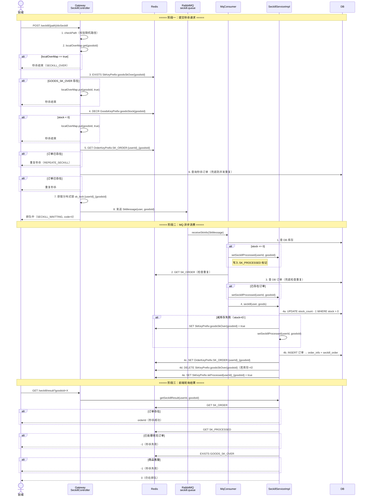
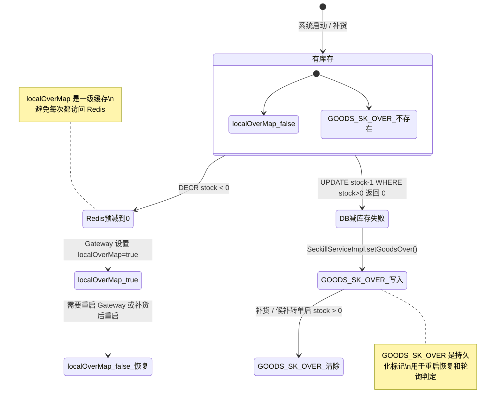
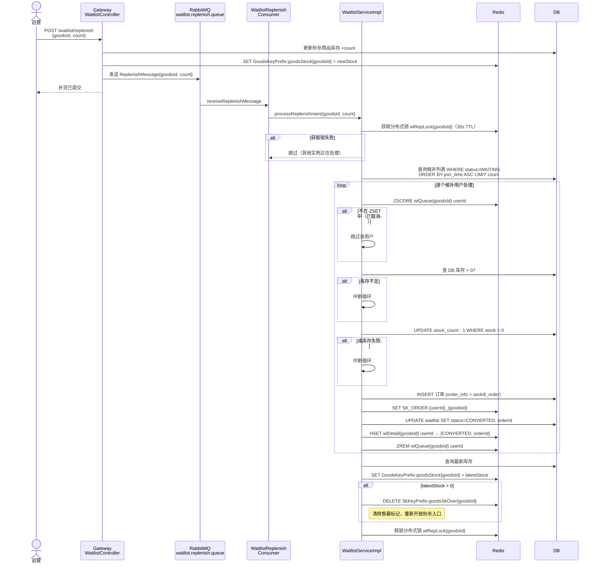
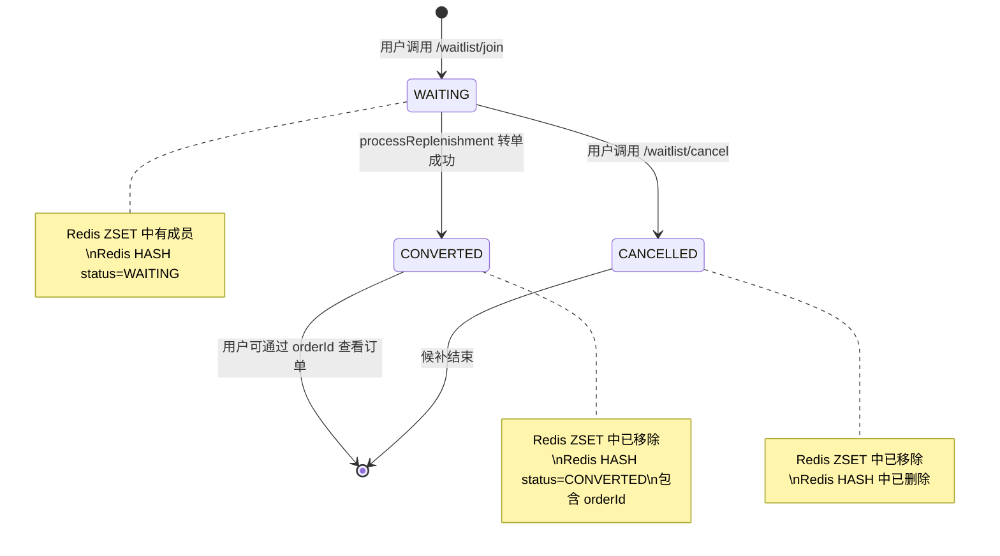

# 异步秒杀与候补转单技术说明

## 一、整体架构概览

系统采用 **「内存标记 → Redis 预减 → MQ 异步下单」** 三级漏斗架构，将海量秒杀请求逐层过滤，最终只有少量有效请求落入 DB。在此基础上增加了 **候补排队（Waitlist）** 机制——当商品售罄后，用户可加入候补队列；一旦有补货，系统通过 MQ 驱动自动为候补用户转单。

```
┌──────────────┐     ┌─────────────┐     ┌──────────────┐     ┌────────┐
│   Gateway    │────▶│    Redis    │────▶│  RabbitMQ    │────▶│   DB   │
│ (Controller) │     │ (预减/标记)  │     │ (异步削峰)    │     │ (落单) │
└──────────────┘     └─────────────┘     └──────────────┘     └────────┘
  localOverMap          GOODS_STOCK        seckill.queue       减库存
  (JVM 内存)            GOODS_SK_OVER      waitlist.replenish   写订单
                        SK_PROCESSED        .queue
```

**涉及模块：**

| 模块 | 职责 |
|------|------|
| `dis-seckill-gateway` | 接收前端请求，三级过滤，发送 MQ 消息，提供轮询接口 |
| `dis-seckill-mq` | MQ 消费者：`MqConsumer`（秒杀下单）、`WaitlistReplenishConsumer`（候补转单） |
| `dis-seckill-goods` | 核心业务逻辑：`SeckillServiceImpl`、`WaitlistServiceImpl` |
| `dis-seckill-order` | 订单创建（DB + Redis 双写） |
| `dis-seckill-cache` | Redis 操作封装、分布式锁 |

---

## 二、异步秒杀主链路

### 2.1 时序图



### 2.2 doSeckill 三级漏斗详解

| 层级 | 检查点 | 数据源 | 作用 |
|------|--------|--------|------|
| L1 | `localOverMap` | JVM 内存 | 最快短路，零网络开销 |
| L2 | `GOODS_SK_OVER` + `DECR GOODS_STOCK` | Redis | 精确预减库存，跨实例一致 |
| L3 | `SK_ORDER` 查询 | Redis + DB | 防止同一用户重复秒杀 |

通过漏斗后的请求加分布式锁 `sk_lock:{userId}_{goodsId}`（5s TTL）后投入 MQ，避免同一用户并发产生多条消息。

### 2.3 getSeckillResult 轮询判定逻辑

前端在提交秒杀请求后，以轮询方式调用 `GET /seckill/result` 获取结果。判定优先级如下：

```
                    ┌─────────────────────────┐
                    │  getSeckillResult 入口   │
                    └────────┬────────────────┘
                             │
                    ┌────────▼────────────────┐
                    │ Redis/DB 查订单 SK_ORDER │
                    └────────┬────────────────┘
                        存在 │          不存在
                  ┌─────────▼──┐   ┌────────▼───────────────┐
                  │ 返回 orderId│   │ Redis 查 SK_PROCESSED  │
                  │ （成功）     │   └────────┬───────────────┘
                  └────────────┘       true  │         false
                              ┌──────────────▼──┐  ┌────────▼──────────────┐
                              │ 返回 -1（失败）   │  │ Redis 查 GOODS_SK_OVER│
                              └─────────────────┘  └────────┬──────────────┘
                                                     true   │        false
                                             ┌──────────────▼──┐  ┌──────▼───────┐
                                             │ 返回 -1（失败）   │  │ 返回 0（排队）│
                                             └─────────────────┘  └──────────────┘
```

**「一直排队中」问题的根因与修复：**

如果 MQ 消费者处理完消息后未写入 `SK_PROCESSED` 标记，且此时商品未完全售罄（`GOODS_SK_OVER` 不存在），`getSeckillResult` 会持续返回 `0`（排队中），前端永远无法得到最终结果。

当前代码中 `MqConsumer.receiveSkInfo()` 在 **所有出口**（库存不足、重复订单、秒杀成功）都会调用 `setSeckillProcessed()`，确保写入 `SkKeyPrefix:skProcessed{userId}_{goodsId} = true`。这样即使秒杀失败，轮询也能在下一次检查时通过 `SK_PROCESSED` 得到明确的失败结果（返回 -1），不会卡在排队状态。

---

## 三、localOverMap 与 Redis GOODS_SK_OVER 的关系

### 3.1 两层标记的设计动机

| 对比项 | `localOverMap`（JVM 内存） | `GOODS_SK_OVER`（Redis） |
|--------|--------------------------|--------------------------|
| 作用域 | 单个 Gateway 实例 | 所有实例共享 |
| 访问开销 | ~ns 级（ConcurrentHashMap） | ~ms 级（Redis 网络往返） |
| 持久性 | 进程重启后丢失 | Redis 持久化，重启后仍在 |
| 写入时机 | Redis DECR stock < 0 时 | DB 减库存失败（stock = 0）时 |

### 3.2 生命周期



### 3.3 启动时恢复流程

`SeckillController` 实现了 `InitializingBean`，在 `afterPropertiesSet()` 中：

1. 从 DB 加载所有秒杀商品
2. 将库存写入 `GoodsKeyPrefix:goodsStock{goodsId}`
3. 检查 `SkKeyPrefix:goodsSkOver{goodsId}` 是否存在：
   - 存在 → `localOverMap.put(goodsId, true)`（恢复售罄标记）
   - 不存在 → `localOverMap.put(goodsId, false)`

### 3.4 多实例场景注意事项

当部署多个 Gateway 实例时：
- 实例 A 的 `localOverMap` 先标记售罄，但实例 B 可能还未标记（因为 B 还没执行到 DECR < 0）
- 实例 B 会在 DECR 或检查 `GOODS_SK_OVER` 时追上状态
- `GOODS_SK_OVER` 作为 **跨实例共享的 ground truth**，保证最终一致
- **补货后** `GOODS_SK_OVER` 被删除，但各实例的 `localOverMap` 不会自动清除——需要重启 Gateway 或通过额外机制通知（当前代码无此通知机制）

---

## 四、候补排队与转单链路

### 4.1 候补加入流程

用户在商品售罄后可调用 `POST /waitlist/join` 加入候补队列：

1. 校验秒杀活动仍在有效期
2. 校验用户未持有该商品订单
3. 校验用户未在候补队列中（`ZSCORE wlQueue{goodsId} userId`）
4. 生成唯一 ticketNo
5. DB 插入候补记录（status = `WAITING`）
6. Redis ZADD `wlQueue{goodsId}` member=userId score=timestamp
7. Redis HSET `wlDetail{goodsId}` field=userId value=JSON{WAITING, joinTime, position, ticketNo}
8. 返回 ticketNo 和排队位置

### 4.2 补货触发转单时序图



### 4.3 候补状态转移



---

## 五、秒杀结果状态转移全景

以一次秒杀请求的生命周期为视角，展示 Redis 标记和 `getSeckillResult` 返回值的变化：

```
时间线 ──────────────────────────────────────────────────────────▶

事件:    doSeckill入MQ    MqConsumer开始处理    处理完成
           │                    │                  │
           ▼                    ▼                  ▼
Redis:                                       SK_PROCESSED=true
          无订单              无订单           ┌ 有订单(成功路径)
                                              └ 无订单(失败路径)

轮询      返回 0              返回 0          ┌ 返回 orderId (成功)
结果:   (排队中)            (排队中)          └ 返回 -1      (失败)
```

| getSeckillResult 返回值 | 含义 | 前端行为 |
|------------------------|------|---------|
| `orderId > 0` | 秒杀成功，订单已创建 | 跳转订单详情页 |
| `-1` | 秒杀失败（库存不足/重复/已处理无订单） | 显示秒杀失败，可引导进入候补 |
| `0` | 消息尚在 MQ 中排队/正在消费中 | 继续轮询（建议间隔 1~2 秒） |

---

## 六、关键 Redis Key 速查

下表仅列出秒杀和候补链路中的核心 key，完整列表见 [Redis中存储的数据.md](./Redis中存储的数据.md)。

| Redis Key | 类型 | 写入时机 | 核心作用 |
|-----------|------|---------|---------|
| `GoodsKeyPrefix:goodsStock{gid}` | STRING | 启动加载 / 秒杀后刷新 / 补货后刷新 | 预减库存，挡住超卖请求 |
| `SkKeyPrefix:goodsSkOver{gid}` | STRING | DB 减库存失败时 | 全局售罄标记，轮询判定 + 重启恢复 |
| `SkKeyPrefix:skProcessed{uid}_{gid}` | STRING | MQ 消费完成时（任何出口） | 防止轮询永远返回"排队中" |
| `OrderKeyPrefix:SK_ORDER:{uid}_{gid}` | STRING | 下单成功时 | 防重复 + 轮询判定成功 |
| `WaitlistKeyPrefix:wlQueue{gid}` | ZSET | 加入候补时 | 候补 FIFO 队列 |
| `WaitlistKeyPrefix:wlDetail{gid}` | HASH | 加入/转单/取消时 | 候补状态详情 |
| `WaitlistKeyPrefix:wlRepLock{gid}` | STRING | 转单处理时 | 分布式锁，防并发转单 |

---

## 七、运维排查指南

### 7.1 前端一直显示「排队中」

**排查步骤：**

1. 确认 MQ 消费者正常运行：
   ```bash
   # RabbitMQ 管理界面检查 seckill.queue 是否有积压消息
   rabbitmqctl list_queues name messages consumers
   ```

2. 检查 `SK_PROCESSED` 是否已写入：
   ```bash
   redis-cli GET "SkKeyPrefix:skProcessed{userId}_{goodsId}"
   ```
   - 如果为空：MQ 消息尚未被消费，或消费者异常退出
   - 如果为 `true`：标记已写入，检查 `getSeckillResult` 是否被正确调用

3. 检查 `GOODS_SK_OVER`：
   ```bash
   redis-cli GET "SkKeyPrefix:goodsSkOver{goodsId}"
   ```

4. 检查订单是否已创建：
   ```bash
   redis-cli GET "OrderKeyPrefix:SK_ORDER:{userId}_{goodsId}"
   ```

### 7.2 补货后前端仍显示售罄

**原因：** `localOverMap` 是 JVM 内存标记，补货时 `WaitlistServiceImpl` 只清除了 Redis 中的 `GOODS_SK_OVER`，但各 Gateway 实例的 `localOverMap` 仍为 `true`。

**处理：** 重启 Gateway 实例。`afterPropertiesSet()` 会重新从 Redis 读取 `GOODS_SK_OVER` 恢复 `localOverMap`。

### 7.3 候补转单未执行

**排查步骤：**

1. 确认 `waitlist.replenish.queue` 消费者在线
2. 检查分布式锁是否被残留：
   ```bash
   redis-cli GET "WaitlistKeyPrefix:wlRepLock{goodsId}"
   ```
   如果锁存在但消费者已退出，需等待 30s TTL 自动过期
3. 确认 DB 中有 `status=WAITING` 的候补记录
4. 确认 ZSET 中用户仍存在：
   ```bash
   redis-cli ZSCORE "WaitlistKeyPrefix:wlQueue{goodsId}" "{userId}"
   ```
